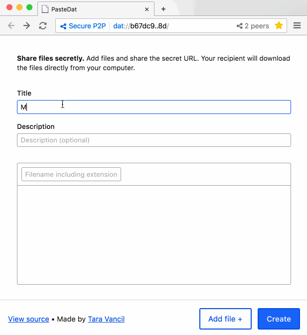

# PasteDat

PasteDat is a peer-to-peer gist-like tool. It uses the
[Beaker browser's](https://beakerbrowser.com)
[APIs](https://beakerbrowser.com/docs/apis/) to write files with the
[Dat protocol](https://github.com/datproject/dat).

All file snippets created with PasteDat are hosted directly from your devic
and on a peer-to-peer network, and only people who know the secret URL can
discover and download the files. [Learn more](https://beakerbrowser.com/docs/tutorials/share-files-secretly.html).

[Install Beaker](https://beakerbrowser.com/docs/install/), then try it out
at
`dat://43dfc9f23fdded8cc7c01c71c0702a0529130af0258e7fb30bf5a0a3f73d69b3`



## Install

### With Beaker

Download the [Beaker browser](https://beakerbrowser.com/docs/install/), then
open PasteDat at
`dat://43dfc9f23fdded8cc7c01c71c0702a0529130af0258e7fb30bf5a0a3f73d69b3`.
To enable PasteDat while you're offline, save it to your Library in Beaker.

### With the Dat CLI

To create your own instance of PasteDat, clone the source, build it with
[npm](https://www.npmjs.com/), and then serve with the
[Dat CLI](https://github.com/datproject/dat/):

```bash
git clone git@github.com:taravancil/paste-dat.git
cd paste-dat
npm install
npm run build
dat share
```

Finally, open the the Dat URL in [Beaker](https://beakerbrowser.com).
